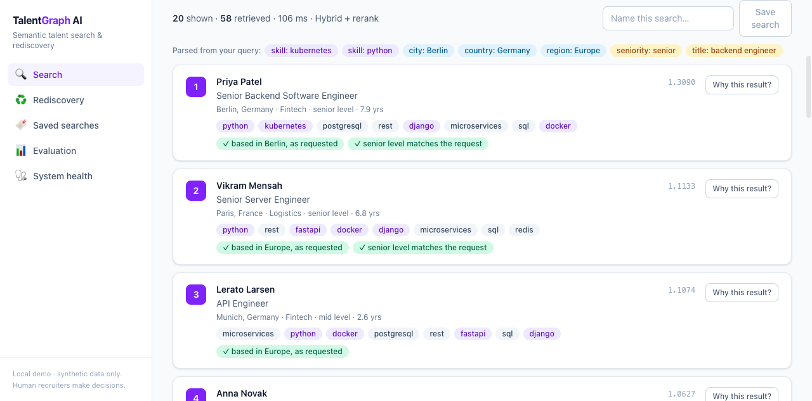
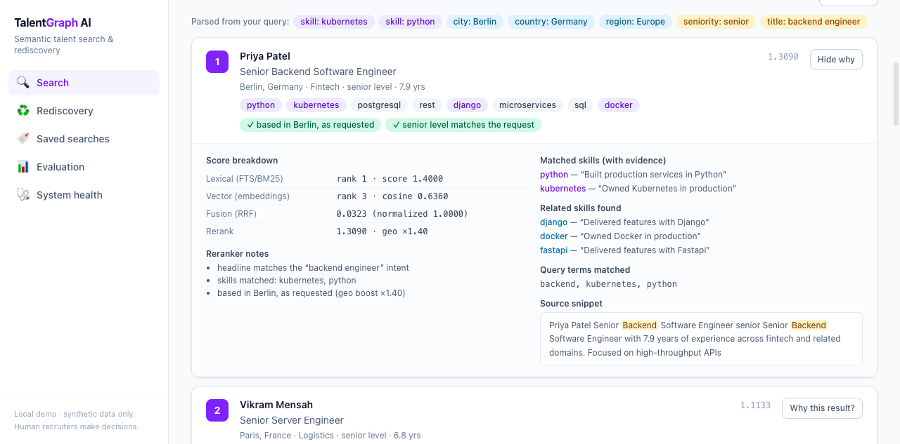
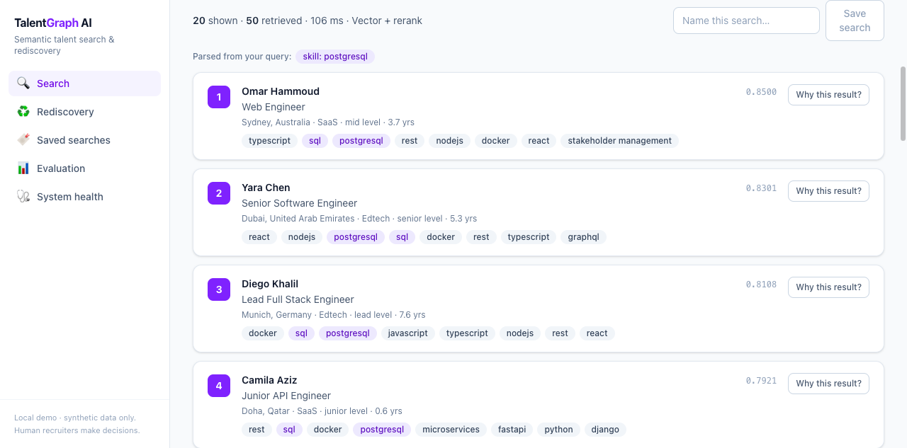
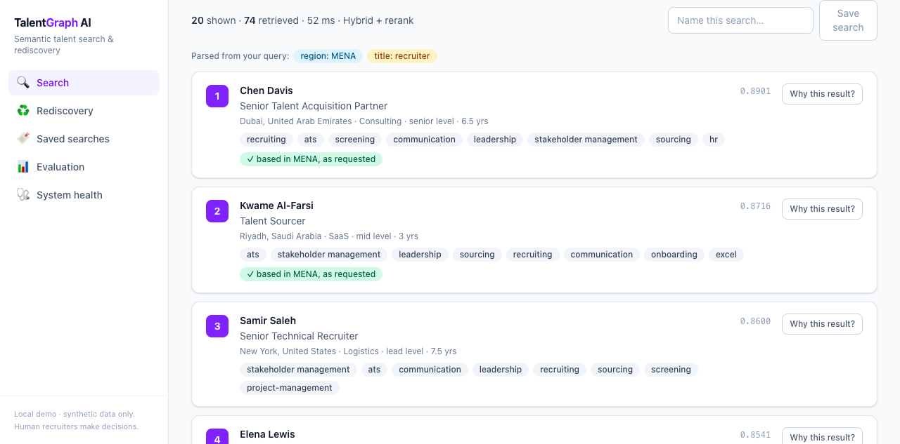
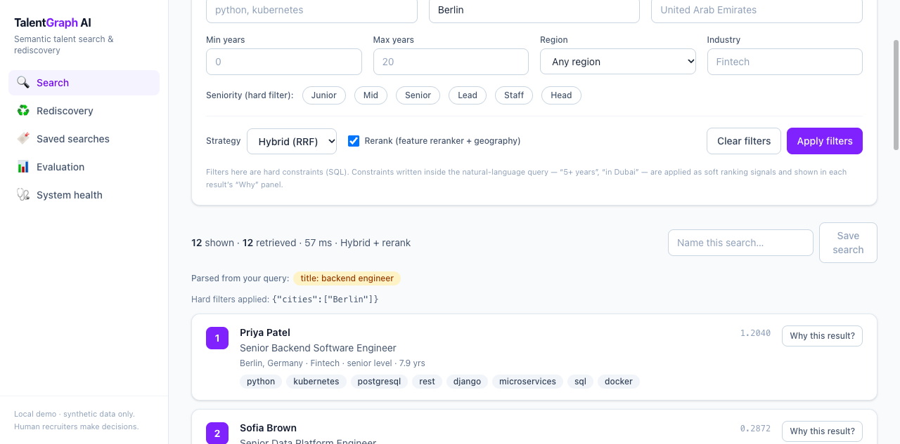
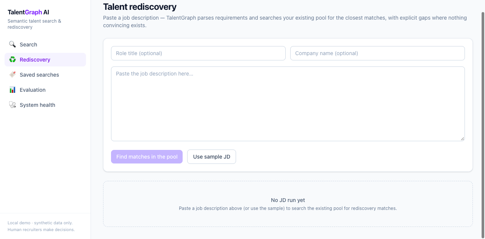
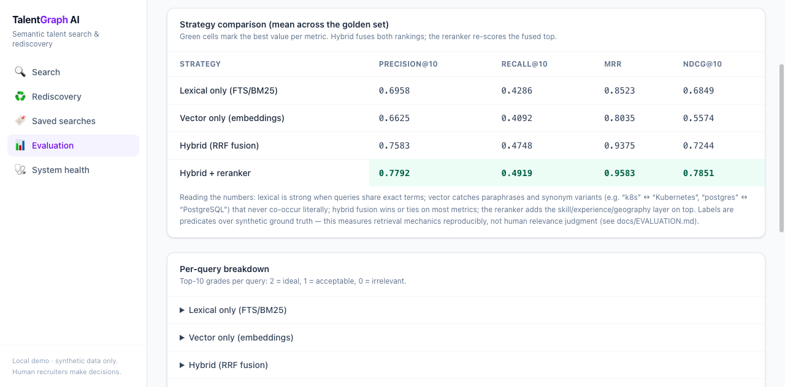
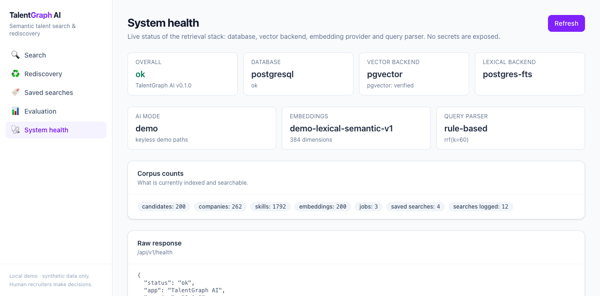

# TalentGraph AI

**Semantic talent search and candidate rediscovery engine** — search your
talent pool the way recruiters actually think: *"senior Python backend
engineer in Berlin with Kubernetes experience"*, not `python AND berlin`.

Every result explains itself (lexical rank, vector similarity, fusion score,
reranker notes, and the exact resume lines that matched), and the retrieval
quality is **measured** — four strategies benchmarked on a fixed golden set
with Precision@K, Recall@K, MRR and nDCG.

> Runs fully **without any API key**: deterministic demo embeddings and a
> rule-based query parser are the default paths. Configure OpenAI and the same
> interfaces switch to live embeddings + LLM parsing (`/health` always says
> which mode is active).

[](https://github.com/Nihal-MN/talentgraph-ai/actions/workflows/ci.yml)
[](LICENSE)
[](backend/pyproject.toml)
[](frontend/package.json)

---

## Why this is different from "candidate search"

Keyword search misses the things recruiters actually type:

| You search | Keyword search | TalentGraph |
|---|---|---|
| `k8s` | finds only "k8s" | canonicalizes to Kubernetes, finds every mention |
| `postgres` | misses "PostgreSQL" | matches via canonical skill + embeddings |
| "payments experience" | finds nothing | scores fintech profiles on evidence |
| "in the Gulf" | finds nothing | regional scope boost (MENA) with explanation |

And every result tells you **why** it matched — with the source quote, not a
similarity score you're asked to trust.

## Quick start

```bash
git clone https://github.com/Nihal-MN/talentgraph-ai.git
cd talentgraph-ai
docker compose up --build -d
# open http://localhost:3400
```

First boot migrates the database, seeds **200 synthetic profiles**, computes
all embeddings and runs the retrieval benchmark — then serves the UI.
No keys, no signup, ~2 minutes on a laptop.

> Not Docker? `cd backend && uv sync && uv run python -m app.seed && uv run uvicorn app.main:app` plus `cd frontend && npm ci && npm run dev`.

### Try these

1. **`senior python backend engineer in Berlin with kubernetes experience`**
   → watch the parsed chips, then hit *Why this result?* on the top hit —
   lexical rank, cosine similarity, RRF fusion, reranker notes (including the
   geography boost), and the resume lines that matched.
2. **`technical recruiter in the Gulf`** → regional scope in action; MENA
   recruiters rise with a visible `geo boost ×1.35` note.
3. **`postgres`** with strategy *Vector only* vs *Lexical only* → see why
   hybrid exists.
4. **Rediscovery** → paste the sample JD → matches + explicit gaps.
5. **Evaluation** → the four-strategy benchmark table with real numbers.

## Screenshots

| | |
|---|---|
|  **Natural-language search** — parsed chips, ranked results, per-result signals |  **Why this result?** — score breakdown, reranker notes (geo boost), matched skills with source quotes |
|  **Vector-only vs lexical-only** — embeddings catch "Postgres"↔"PostgreSQL" |  **Regional scope** — "in the Gulf" lifts MENA recruiters with an explicit note |
|  **Hard filters** — explicit filters are strict SQL constraints |  **Rediscovery** — paste a JD, get matches + honest gaps |
|  **Evaluation** — four strategies, real IR metrics, measured |  **System health** — pgvector verified, backend + mode transparency |

*(All screenshots captured from the docker stack; synthetic data only.)*

## How it works

```
query → parse (intent) → soft/hard split → candidate set
      → lexical retrieval (PG FTS / BM25) ┐
      → vector retrieval (pgvector / cos) ┤→ RRF fusion → reranker → evidence + log
```

- **Hybrid retrieval, actually hybrid**: PostgreSQL FTS (or BM25 on the
  SQLite dev fallback) + embeddings retrieval, combined with Reciprocal Rank
  Fusion — no score-scale hacks (ADR 0002).
- **Explainable reranker**: transparent weights + a geography multiplier
  (city ×1.40 > country/region ×1.35), every component printed per result.
- **Soft vs hard constraints** (ADR 0003): constraints *written in prose* are
  soft ranking signals; constraints you *set as filters* are hard SQL. This
  is a deliberate design decision, benchmarked and documented.
- **Measurable quality**: a 24-query golden set with graded ground-truth
  labels, four strategies compared, runs persisted and displayed. Numbers and
  honest limits in [docs/EVALUATION.md](docs/EVALUATION.md).
- **Keyless demo intelligence**: deterministic feature-hashed embedder whose
  canonicalization is visible in the code — not a black box (ADR 0001).

Full detail: [docs/ARCHITECTURE.md](docs/ARCHITECTURE.md) ·
Decisions: [docs/adr/](docs/adr/) (4 ADRs) ·
Evaluation honesty: [docs/EVALUATION.md](docs/EVALUATION.md)

## The pages

| Page | What you do there |
|---|---|
| **Search** (`/`) | NL search, hard filters panel, per-result "Why", save searches, paste-ingest a resume |
| **Candidate** (`/candidates/:id`) | full profile: skills with evidence quotes, experience, education, embedding info |
| **Saved searches** (`/saved`) | re-run a named search against the current pool in one click |
| **Rediscovery** (`/rediscovery`) | paste a JD → parsed requirements → ranked pool matches + gaps |
| **Evaluation** (`/evaluation`) | strategy comparison table (P@K/R@K/MRR/nDCG), per-query breakdown, search analytics |
| **System health** (`/health`) | live backend status: FTS vs BM25, pgvector verification, embedding mode |

## Stack

| Layer | Tech |
|---|---|
| API | Python 3.12 · FastAPI · SQLAlchemy 2 · Alembic · uv |
| Retrieval | PostgreSQL 16 + pgvector (native `vector` + HNSW index) · FTS ranking; SQLite + BM25 fallback for hermetic tests |
| Embeddings | deterministic demo embedder (default) · OpenAI `text-embedding-3-small` adapter |
| Web | Next.js 16 · React 19 · Tailwind 4 · TypeScript (strict) |
| Tests | pytest (backend, incl. named eval suite) · Vitest + Testing Library (web) |
| CI | GitHub Actions: SQLite suite + real pgvector service suite + frontend + Docker builds |

## Testing

```bash
make test   # backend suite (111 tests) — or: cd backend && uv run pytest -q
make eval   # named retrieval evals (20) — pytest tests/evals -q
make fe-test
make bench  # re-run + persist the retrieval benchmark
```

The suite runs twice in CI: hermetic **SQLite** and a real
**pgvector/pgvector:pg16** service — so both backends are genuinely
exercised. The named eval suite (`backend/tests/evals/`) states product
claims one by one (synonym retrieval, geography scope, filter strictness,
evidence traceability, injection posture, determinism, latency, …).

## Configuration

Everything optional — defaults run keyless. Copy `.env.example` → `.env` to
override.

| Variable | Default | Purpose |
|---|---|---|
| `DATABASE_URL` | SQLite dev file / compose PG | SQLAlchemy URL |
| `AI_PROVIDER` | `auto` | `auto` \| `demo` (force keyless) \| `openai` |
| `OPENAI_API_KEY` | — | enables live embeddings + LLM parsing in `auto` |
| `EMBEDDING_DIMS` | `384` | vector size (demo default; re-embed after change) |
| `CORS_ORIGINS` | `http://localhost:3400` | browser origins allowed to call the API |
| `WEB_PORT` / `API_PORT` / `POSTGRES_PORT` | `3400` / `8300` / `5434` | compose ports |

## API (short version)

`POST /api/v1/search` · `GET /api/v1/search/recent` ·
`GET /api/v1/search/queries/{id}` · `GET /api/v1/candidates` ·
`GET /api/v1/candidates/{id}` · `POST /api/v1/candidates/ingest` ·
`GET|POST /api/v1/saved-searches` (+ `/{id}/run`, `DELETE`) ·
`POST /api/v1/rediscovery` · `GET|POST /api/v1/evaluation/benchmark|run` ·
`GET /api/v1/health` — interactive docs at `http://localhost:8300/docs`.

## What it is not

- **Not a hiring decision system.** No auto-reject, no scoring of people —
  ranking plus evidence for a human reviewer. See
  [RESPONSIBLE_AI.md](RESPONSIBLE_AI.md).
- **Not key-scraped data.** Every profile is generated by a deterministic
  script; contact details are fabricated.
- **Not astroturfed.** No stars, no bot traffic, no fake users.

## License

[MIT](LICENSE) — use it, learn from it, build on it.

---

*Part of a hiring-tech portfolio: [TalentFlow AI](https://github.com/Nihal-MN/talentflow-ai)
(ATS + human-in-the-loop agent), [RecruitAgent AI](https://github.com/Nihal-MN/recruitagent-ai)
(recruiting ops agent with approvals), and this — TalentGraph AI (retrieval engine).*
